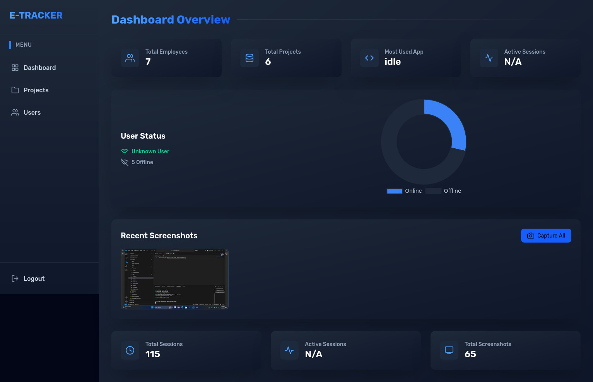
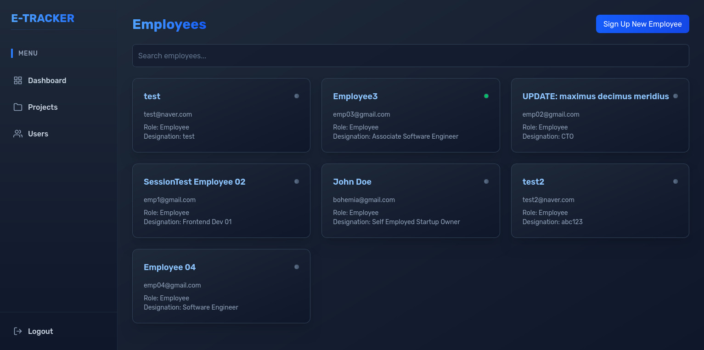
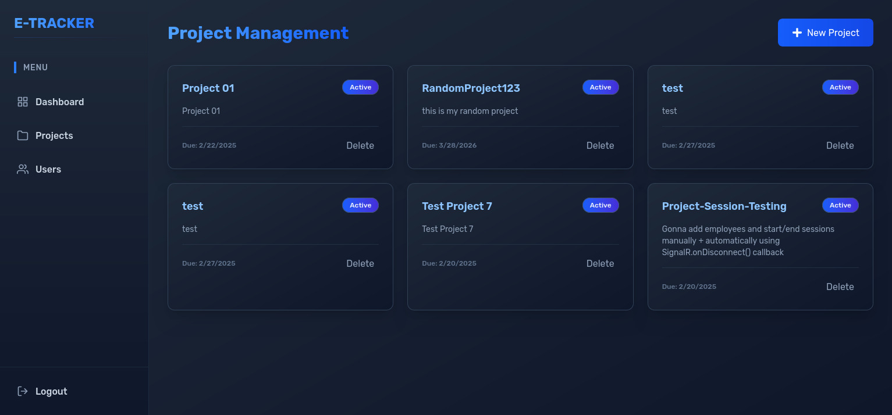
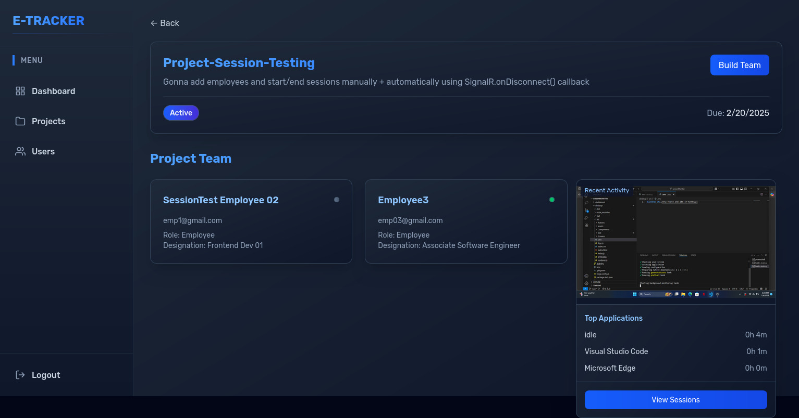
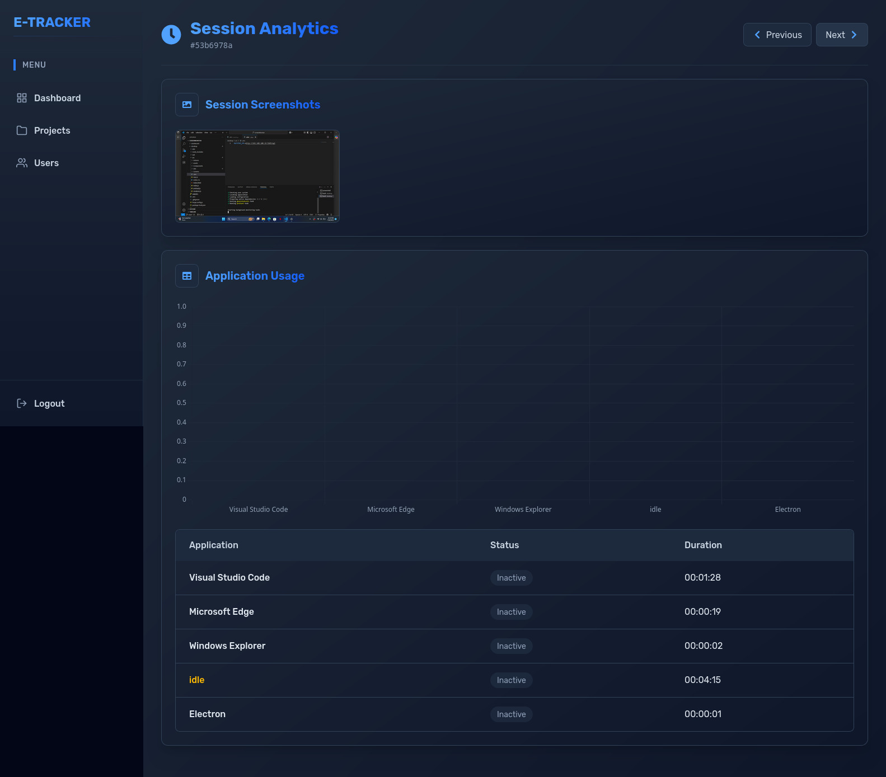

# 📊 Employee Tracking System

A comprehensive **Employee Activity Monitoring** solution consisting of a **React-based web dashboard** for supervisors and an **Electron-based desktop application** for employees.

This system is designed to help employers efficiently manage projects, monitor employee productivity, and maintain transparent work session records with activity tracking and periodic screenshots.

---

## 📖 Project Overview

The system operates in two parts:

1. **Electron Desktop App (for Employees)**
2. **React Web Dashboard (for Supervisors/Employers)**

---

## ⚙️ How It Works

### 🖥️ Employee Side (Electron App)

- The **Electron app runs automatically on system startup** on each employee’s computer.
- Once active, the app checks in with the dashboard, marking the employee as **online**.
- When an employee starts working on a project, a **session is created**.
- During an active session:
  - The app tracks **which applications are in use and their usage durations**.
  - Captures **screenshots of the desktop at defined intervals** (as configured by the employer for each project).
  - Session data, including active applications, durations, and screenshots, is sent to the dashboard for monitoring.

---

### 📊 Supervisor Side (React Dashboard)

- Supervisors can log in to a **React-powered web dashboard**.
- From the dashboard, they can:
  - View a list of **online/offline employees**.
  - **Create and manage projects**.
  - **Assign employees to specific projects**.
  - **Monitor live session statuses**.
  - **View completed sessions** with:
    - Screenshots
    - Applications used
    - Duration for each application
    - Total session duration
  - **Clear completed session records** when needed.

---

## 📌 Key Features

- ✅ Auto-launch Electron app on employee system startup  
- ✅ Real-time employee online/offline status tracking  
- ✅ Project and employee assignment management via dashboard  
- ✅ Application usage tracking during work sessions  
- ✅ Periodic desktop screenshots (configurable intervals)  
- ✅ Detailed session records with activity breakdown  
- ✅ Session management and clearance from the employer dashboard  

---

## 📸 Screenshots







---

## 📥 Installation & Setup

### 🚀 React (Vite) Web Dashboard

#### 📂 Navigate to the dashboard folder:
```bash
cd dashboard
```

#### 📦 Install dependencies:
```bash
npm install
```

#### ⚙️ Configure environment variables:
Create a `.env` file inside the `dashboard/` folder:
```env
VITE_BACKEND_URL="http://localhost:5265/api"
VITE_IMAGE_URL="http://localhost:5265/Uploads"
```

#### ▶️ Run the dashboard:
```bash
npm run dev
```

The dashboard will start at: **http://localhost:5173/**

### 👥 Electron Forge Desktop App (React)

#### 📂 Navigate to the electron app folder:
```bash
cd desktop
```

#### 📦 Install dependencies:
```bash
npm install
```

#### ⚙️ Configure environment variables:
Create a `.env` file inside the `desktop/` folder:
```env
BACKEND_URL="http://localhost:5265/api"
```

#### ▶️ Run the Electron app:
```bash
npm start
```

This will launch the desktop app window.

---

## 📦 Build Production Files

### 📦 Build React Dashboard:
```bash
npm run build
```
The build files will be generated in the `dist/` folder.

### 📦 Package Electron App:
```bash
npm run make
```
This will generate platform-specific executables under the `out/` directory.

---

## 📃 License

*This project is proprietary and intended for internal or commercial use only.*
